<h2>TensorFlow-FlexUNet-Image-Segmentation-Flood (2025/12/01)</h2>

Toshiyuki Arai 
Software Laboratory antillia.com 
 
This is the first experiment of Image Segmentation for <b>Flood</b> (Singleclass) based on 
our <a href="./src/TensorFlowFlexUNet.py">TensorFlowFlexUNet</a>
 (<b>TensorFlow Flexible UNet Image Segmentation Model for Multiclass</b>)
, and a PNG augmented
<a href="https://drive.google.com/file/d/1XLqOkc7G89q-GI7yl7UnwtIzv8sg4CeC/view?usp=sharing">
<b>Flood-ImageMask-Dataset.zip</b></a>
which was derived by us from   
<a href="https://www.kaggle.com/datasets/faizalkarim/flood-area-segmentation/data">
<b>Flood Area Segmentation</b>
</a> on the kaggle web site.
  

<b>Actual Image Segmentation for the Flood Images</b> 
As shown below, the inferred masks predicted by our segmentation model trained on the 
our augmented dataset appear similar to the ground truth masks. 
<table>
<tr>
<th>Input: image</th>
<th>Mask (ground_truth)</th>
<th>Prediction: inferred_mask</th>
</tr>
<tr>
<td>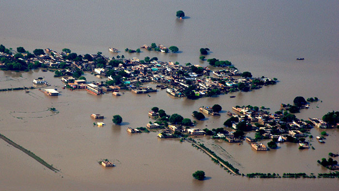</td>
<td>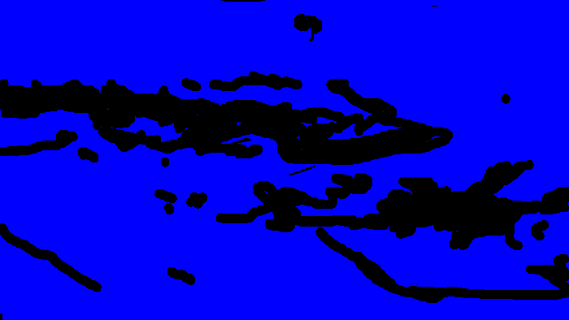</td>
<td></td>
</tr>
</tr>
<td>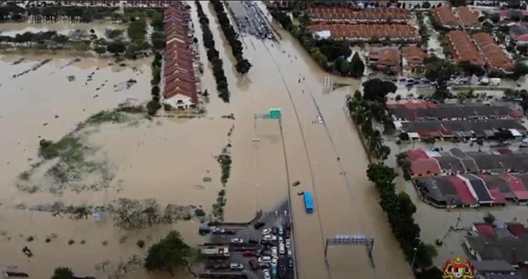</td>
<td>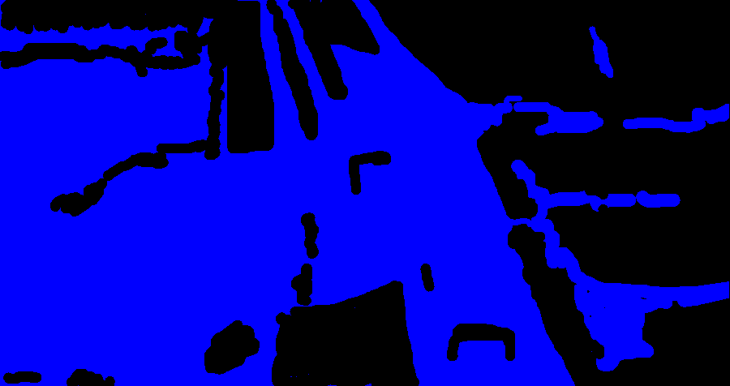</td>
<td>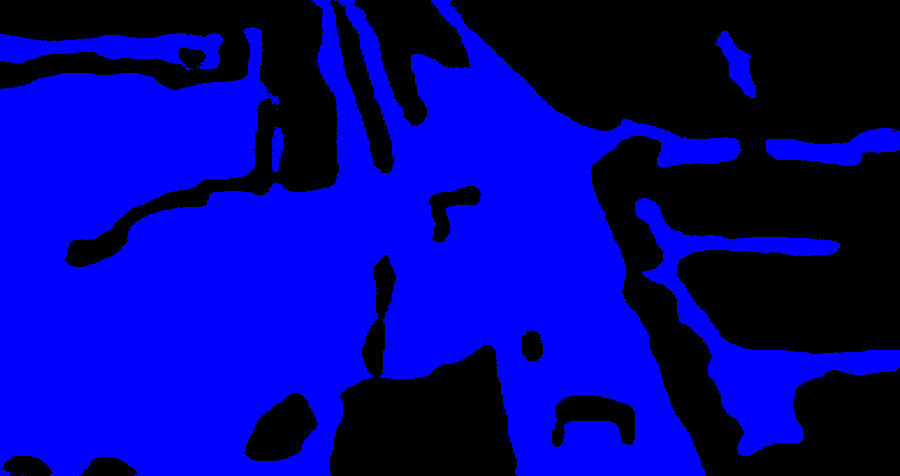</td>
</tr>
<tr>
<td>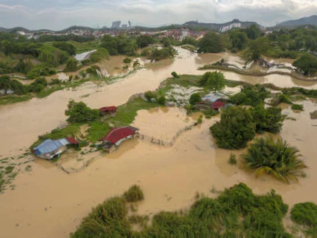</td>
<td>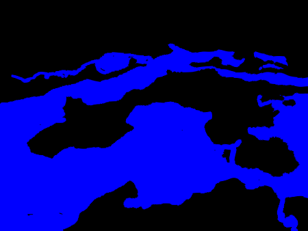</td>
<td>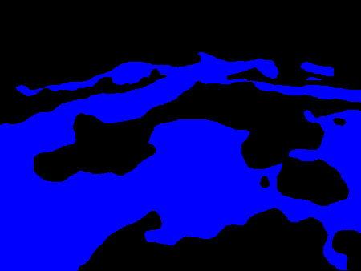</td>
</tr>
</table>

 
<h3>
1 Dataset Citation
</h3>
The dataset used here was derived from <a href="https://www.kaggle.com/datasets/faizalkarim/flood-area-segmentation/data">
<b>Flood Area Segmentation</b>
</a> on the kaggle web site.
  

<b>Author</b> 
Faizal Karim and 2 collaborators 
 
<b>About Dataset</b> 
The dataset contains images of flood hit areas and corresponding mask images showing the water region.
  
There are 290 images and self annoted masks. The mask images were created using Label Studio, an open source data labelling software. The task is to create a segmentation model, which can accurately segment out the water region in a given picture of a flood hit area.
  
Such models cane be used for flood surveys, better decision-making and planning. Because of less data, pre-trained models and data augmentation may be used.
  
<b>License</b> 
<a href="https://creativecommons.org/publicdomain/zero/1.0/">
CC0: Public Domain
</a>
 
 
<h3>
2 Flood ImageMask Dataset
</h3>
<h4>2.1 Download Flood dataset</h4>
 If you would like to train this Flood Segmentation model by yourself,
 please download the augmented <a href="https://drive.google.com/file/d/1XLqOkc7G89q-GI7yl7UnwtIzv8sg4CeC/view?usp=sharing">
 <b>Flood-ImageMask-Dataset.zip</b></a>
on the google drive, expand the downloaded, and put it under dataset folder to be:
<pre>
./dataset
└─Flood
    ├─test
    │  ├─images
    │  └─masks
    ├─train
    │  ├─images
    │  └─masks
    └─valid
        ├─images
        └─masks
</pre>
<b>Tilled-Flood Statistics</b> 
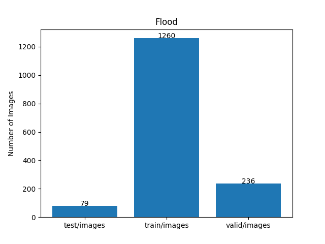 
 
As shown above, the number of images of train and valid datasets is not so large to use for a training set of our segmentation model.
   

<b>Train_images_sample</b> 
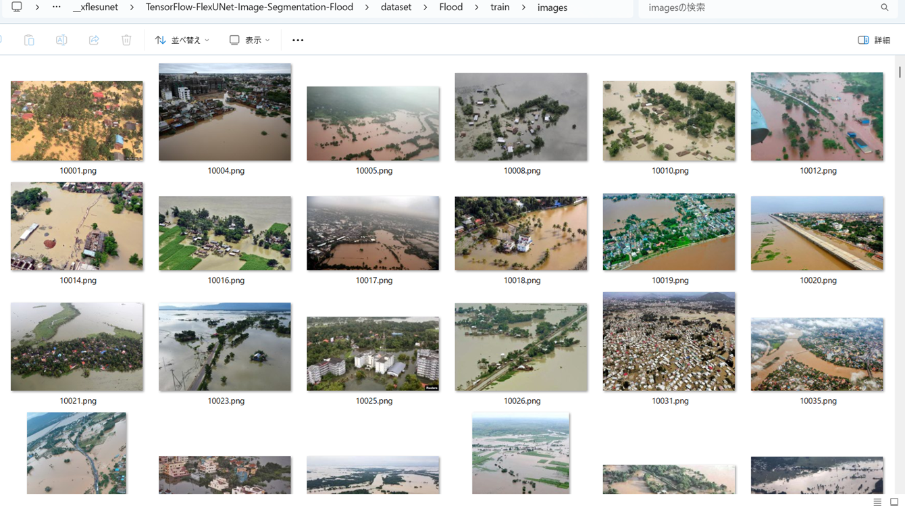
 
<b>Train_masks_sample</b> 
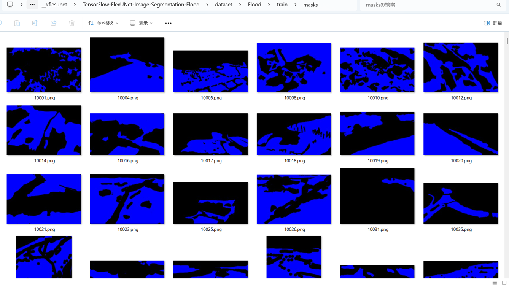
 
 
<h3>
3 Train TensorFlowFlexUNet Model
</h3>
 We trained Flood TensorFlowFlexUNet Model by using the following
<a href="./projects/TensorFlowFlexUNet/Flood/train_eval_infer.config"> <b>train_eval_infer.config</b></a> file.  
Please move to ./projects/TensorFlowFlexUNet/Flood and, and run the following bat file. 
<pre>
>1.train.bat
</pre>
, which simply runs the following command. 
<pre>
>python ../../../src/TensorFlowFlexUNetTrainer.py ./train_eval_infer.config
</pre>

<b>Model parameters</b> 
Defined a small <b>base_filters = 16</b> and small <b>base_kernels = (5,5)</b> for the first Conv Layer of Encoder Block of 
<a href="./src/TensorFlowFlexUNet.py">TensorFlowFlexUNet.py</a> 
and a large num_layers (including a bridge between Encoder and Decoder Blocks).
<pre>
[model]
image_width    = 512
image_height   = 512
image_channels = 3

num_classes    = 2

base_filters   = 16
base_kernels   = (7,7)
num_layers     = 8
dropout_rate   = 0.04
dilation       = (1,1)

</pre>

<b>Learning rate</b> 
Defined a very small learning rate.  
<pre>
[model]
learning_rate  = 0.00007
</pre>

<b>Online augmentation</b> 
Disabled our online augmentation.  
<pre>
[model]
model         = "TensorFlowFlexUNet"
generator     = False
</pre>

<b>Loss and metrics functions</b> 
Specified "categorical_crossentropy" and <a href="./src/dice_coef_multiclass.py">"dice_coef_multiclass"</a>. 
You may specify other loss and metrics function names. 
<pre>
[model]
loss           = "categorical_crossentropy"
metrics        = ["dice_coef_multiclass"]
</pre>
<b>Learning rate reducer callback</b> 
Enabled learing_rate_reducer callback, and a small reducer_patience.
<pre> 
[train]
learning_rate_reducer = True
reducer_factor     = 0.5
reducer_patience   = 4
</pre>

<b>Early stopping callback</b> 
Enabled early stopping callback with patience parameter.
<pre>
[train]
patience      = 10
</pre>

<b>RGB Color map</b> 
rgb color map dict for Flood 1+1 classes.
<pre>
[mask]
mask_datatype    = "categorized"
mask_file_format = ".png"
;                     flood: blue
rgb_map = {(0,0,0):0, (0,0,255):1,}
</pre>

<b>Epoch change inference callback</b> 
Enabled <a href="./src/EpochChangeInferencer.py">epoch_change_infer callback (EpochChangeInferencer.py)</a></b>. 
<pre>
[train]
poch_change_infer     = True
epoch_change_infer_dir =  "./epoch_change_infer"
epoch_change_tiled_infer     = False
epoch_change_tiled_infer_dir =  "./epoch_change_tiled_infer"
</pre>

By using this callback, on every epoch_change, the inference procedure can be called
 for 6 images in <b>mini_test</b> folder. This will help you confirm how the predicted mask changes 
 at each epoch during your training process.    

<b>Epoch_change_inference output at starting (epoch 1,2,3,4)</b> 
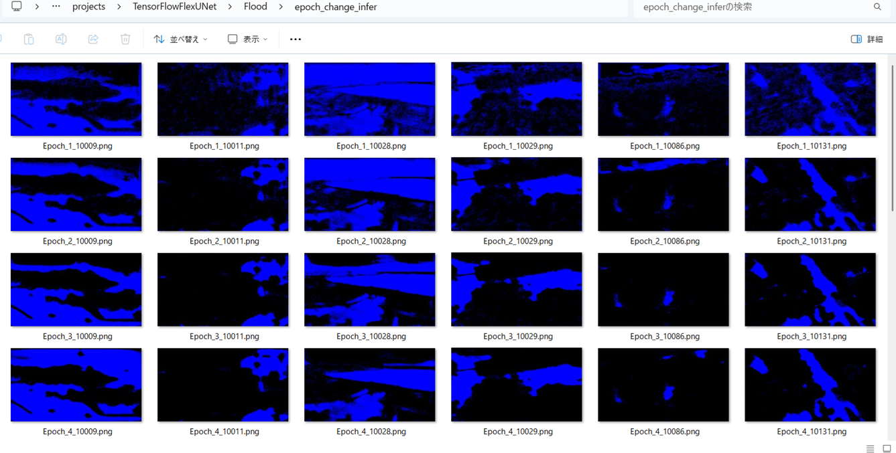 
 
<b>Epoch_change_inference output at middlepoint (epoch 30,31,32,33)</b> 
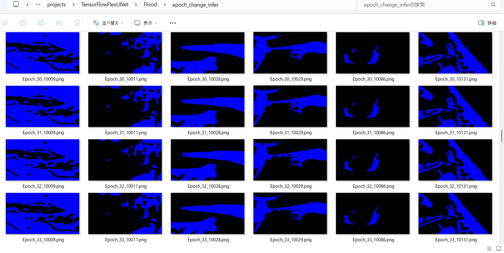 
 

<b>Epoch_change_inference output at ending (epoch 60,61,62,63)</b> 
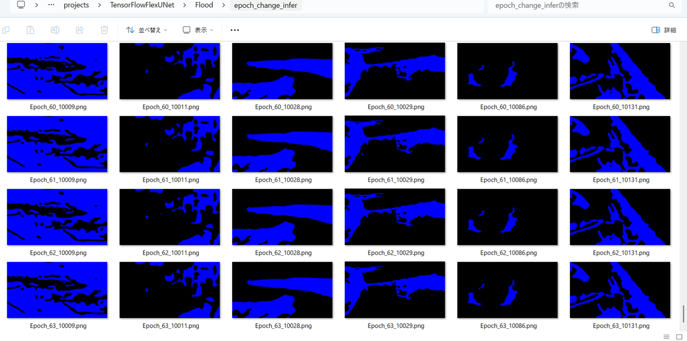 
 

In this experiment, the training process was stopped at epoch 63 by EarlyStoppingCallback.  
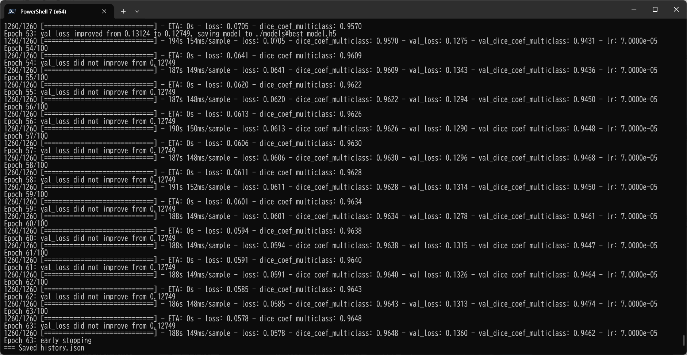 
 

<a href="./projects/TensorFlowFlexUNet/Flood/eval/train_metrics.csv">train_metrics.csv</a> 
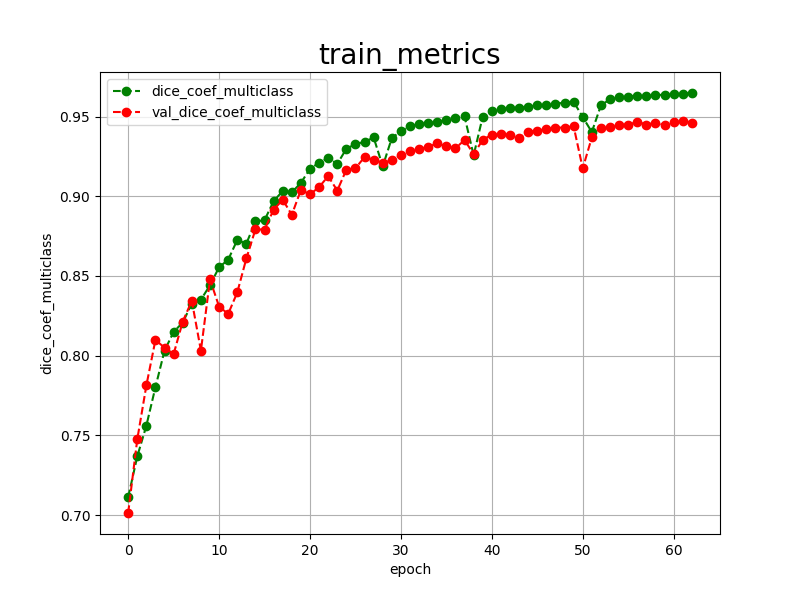 

 
<a href="./projects/TensorFlowFlexUNet/Flood/eval/train_losses.csv">train_losses.csv</a> 
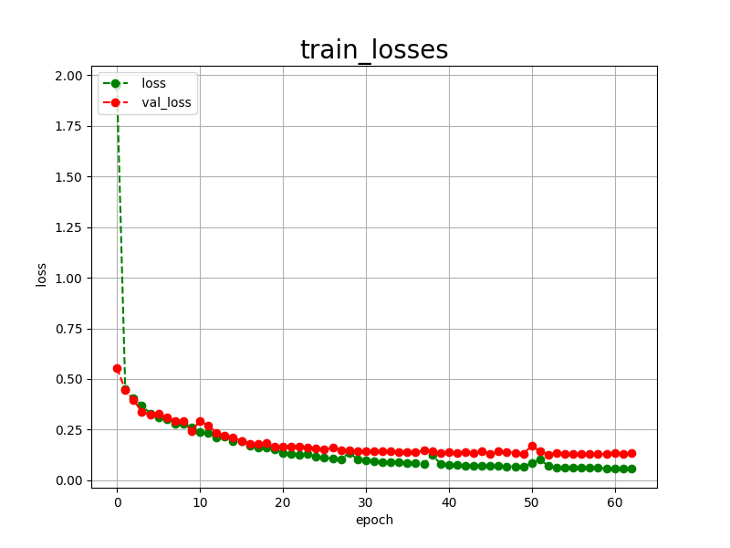 

 

<h3>
4 Evaluation
</h3>
Please move to <b>./projects/TensorFlowFlexUNet/Flood</b> folder, 
and run the following bat file to evaluate TensorFlowUNet model for Flood. 
<pre>
./2.evaluate.bat
</pre>
This bat file simply runs the following command.
<pre>
python ../../../src/TensorFlowFlexUNetEvaluator.py ./train_eval_infer.config
</pre>

Evaluation console output: 
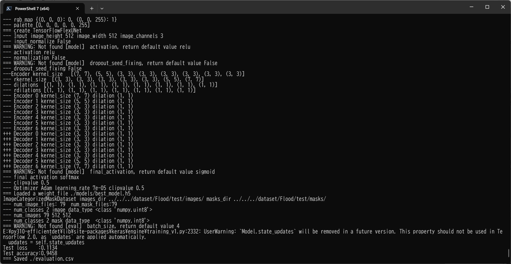
  Flood
<a href="./projects/TensorFlowFlexUNet/Flood/evaluation.csv">evaluation.csv</a> 

The loss (categorical_crossentropy) to this Flood/test was not low, and dice_coef_multiclass not high as shown below.
 
<pre>
categorical_crossentropy,0.1134
dice_coef_multiclass,0.9458
</pre>
 
<h3>
5 Inference
</h3>
Please move to <b>./projects/TensorFlowFlexUNet/Flood</b> folder 
,and run the following bat file to infer segmentation regions for images by the Trained-TensorFlowFlexUNet model for Flood. 
<pre>
./3.infer.bat
</pre>
This simply runs the following command.
<pre>
python ../../../src/TensorFlowFlexUNetInferencer.py ./train_eval_infer.config
</pre>

<b>mini_test_images</b> 
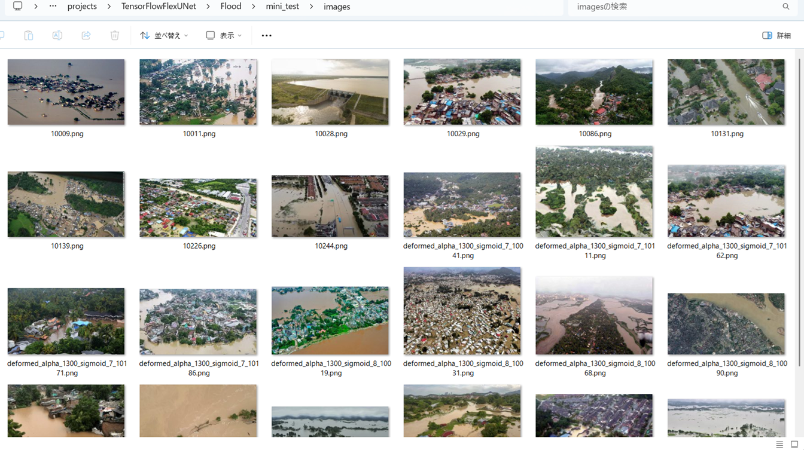 
<b>mini_test_mask(ground_truth)</b> 
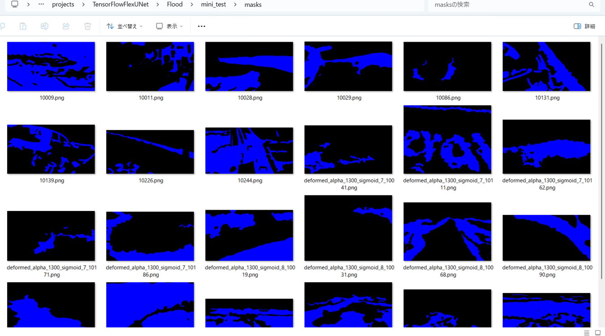 

<b>Inferred test masks</b> 
 
 
 

<b>Enlarged images and masks for the Flood Images </b> 
As shown below, the inferred masks predicted by our segmentation model trained on the 
augmented dataset appear similar to the ground truth masks. 
<table>
<tr>

<th>Image</th>
<th>Mask (ground_truth)</th>
<th>Inferred-mask</th>
</tr>

<td>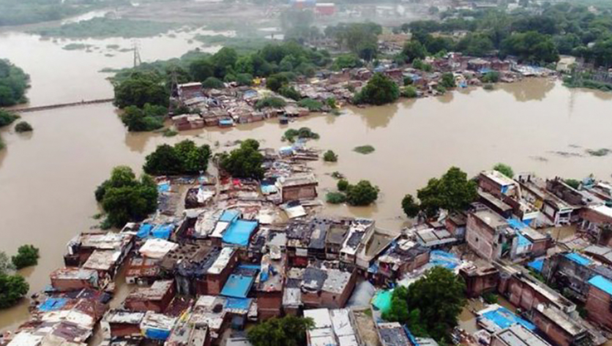</td>
<td>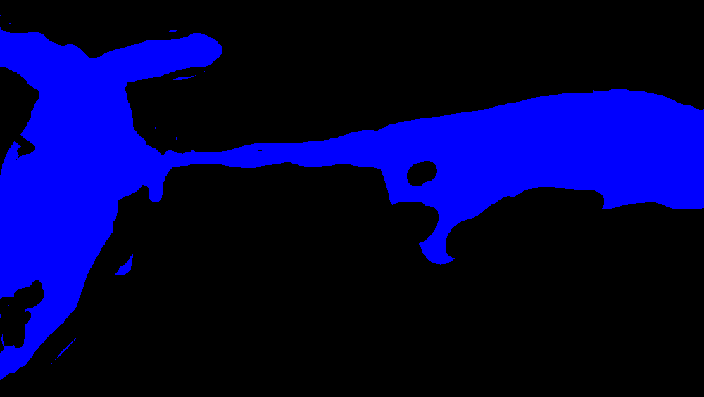</td>
<td>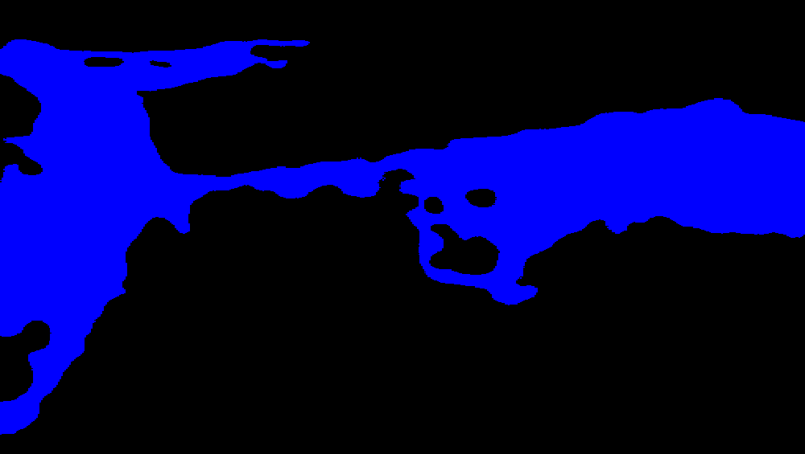</td>
</tr>
<tr>
<td></td>
<td></td>
<td></td>
</tr>
<tr>
<td>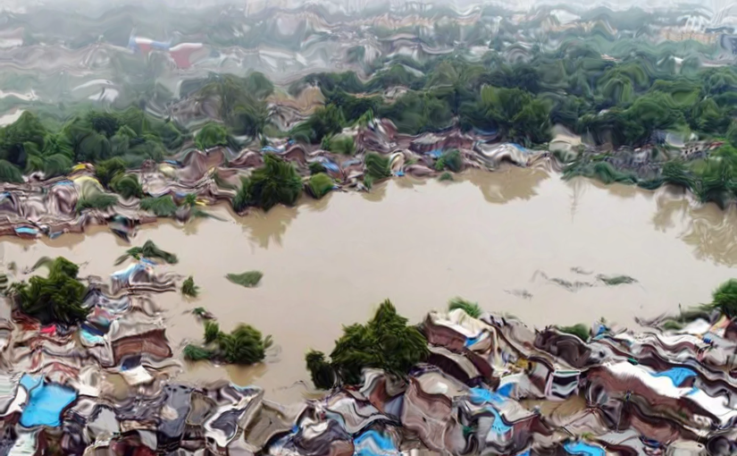</td>
<td>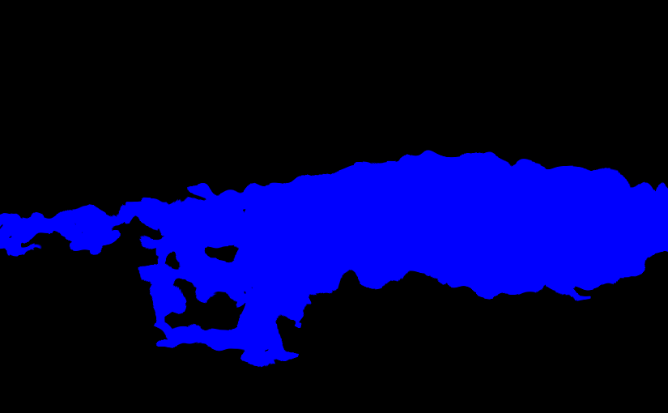</td>
<td>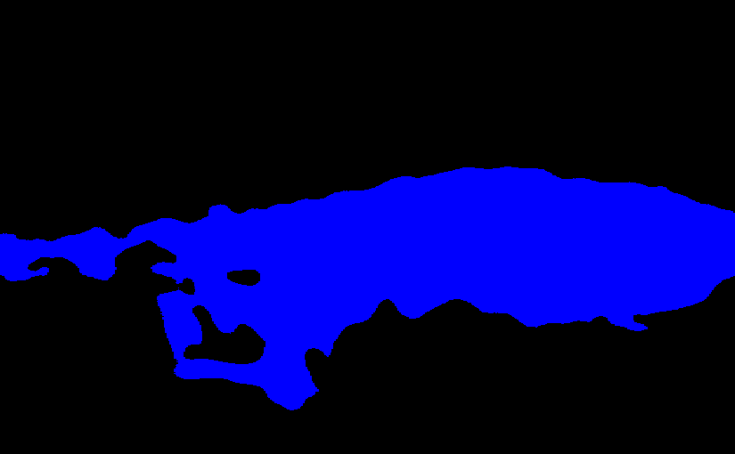</td>
</tr>

<tr>
<td></td>
<td>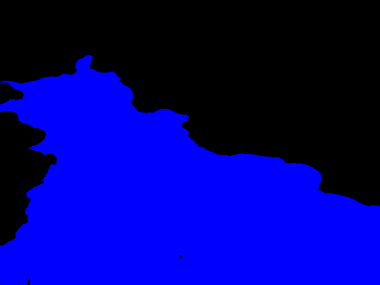</td>
<td>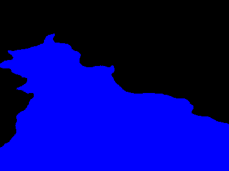</td>
</tr>
<tr>
<td></td>
<td></td>
<td></td>
</tr>
<tr>
<td>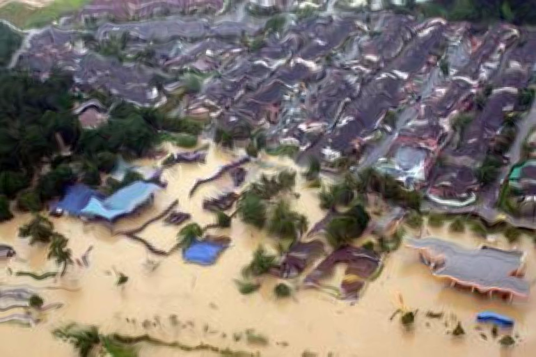</td>
<td></td>
<td>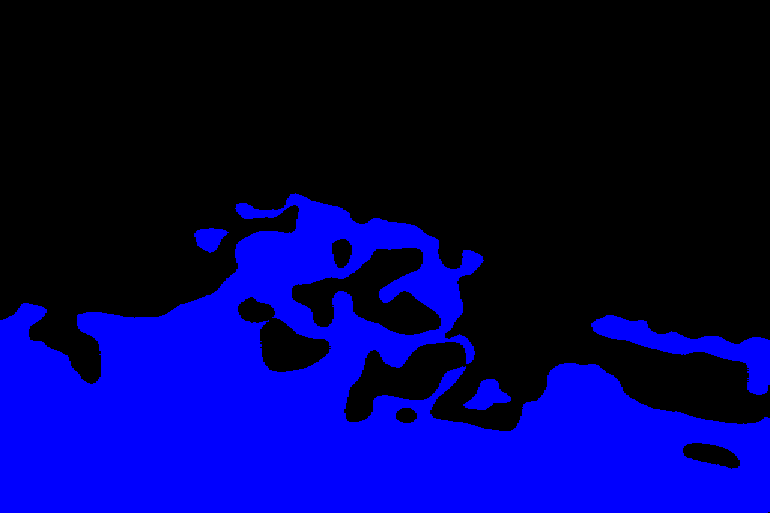</td>
</tr>

</table>

 

<h3>
References
</h3>
<b>1. TensorFlow-FlexUNet-Image-Segmentation-Model</b> 
Toshiyuki Arai antillia.com  
<a href="https://github.com/sarah-antillia/TensorFlow-FlexUNet-Image-Segmentation-Model">
https://github.com/sarah-antillia/TensorFlow-FlexUNet-Image-Segmentation-Model
</a>
 
 
<b>2. TensorFlow-FlexUNet-Image-Segmentation-Aerial-Imagery-Water</b> 
Toshiyuki Arai antillia.com  
<a href="https://github.com/atlan-antillia/TensorFlow-FlexUNet-Image-Segmentation-Aerial-Imagery-Water">
https://github.com/atlan-antillia/TensorFlow-FlexUNet-Image-Segmentation-Aerial-Imagery-Water
</a>

